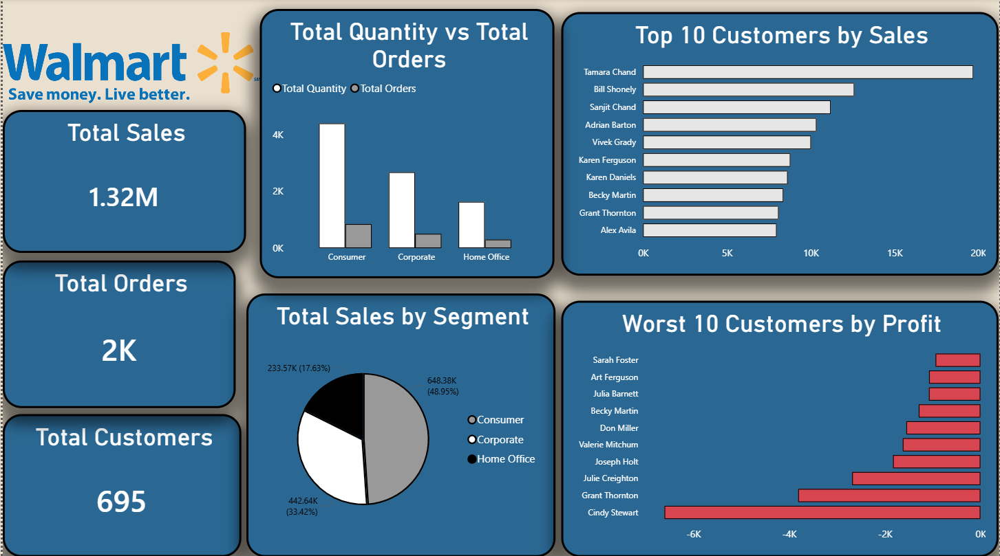
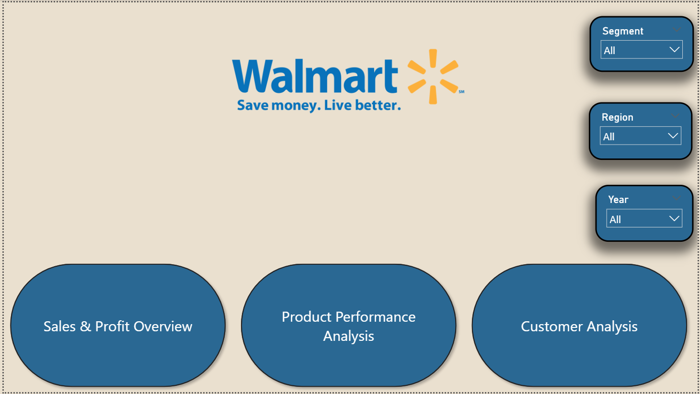

# Sales Performance Dashboard (Power BI)

## Project Overview
This project analyzes sales performance using the **Global Superstore** dataset.  
The dashboard focuses on profitability, product performance, and customer behavior  
to support data-driven business decisions.

## Dataset
Global Superstore (public training dataset)

---

## Dashboard Pages

### 1. Sales & Profit Overview

This page provides a high-level overview of overall sales, profit, profit margin,  
regional performance, category contribution, and monthly sales trends.

---

### 2. Product Performance Analysis

This page analyzes product-level performance, highlighting:
- Top 10 products by sales
- Worst 10 products by profit
- The impact of discounts on profitability

---

### 3. Customer Analysis

This page focuses on customer behavior, including:
- Top 10 customers by sales
- Worst 10 customers by profit
- Sales distribution by customer segment
- Relationship between total orders and total quantity

---

### 4. Interactive Tooltip (Details)

A custom tooltip page was created to provide deeper insights on hover, including:
- Profit margin
- Total sales
- Total profit
- Average discount

---

### 5. Dashboard Navigation

A navigation page with buttons was added to enhance user experience and allow  
easy movement between dashboard sections.

---

## Data Model

The dashboard is built using a **Star Schema** data model to ensure:
- Better performance
- Clear relationships
- Scalable analysis

---

## Key Insights
- Profitability varies significantly across regions, with **Central** outperforming others.
- High discounts negatively impact profit margins.
- Some top-selling products generate losses.
- Sales are concentrated among a small group of customers.
- **February** shows the lowest sales despite high discount rates.

---

## Key Recommendations
- Re-evaluate discount strategies to protect profit margins.
- Focus on high-performing regions and replicate successful strategies in weaker areas.
- Optimize pricing for high-selling but low-profit products.
- Strengthen retention strategies for high-value customers.
- Investigate low-performing months to improve seasonal sales planning.

---

## Tools & Technologies
- Power BI
- DAX
- Data Modeling (Star Schema)
- Data Visualization

---

## Disclaimer
This project is based on a public training dataset and is for educational purposes only.
